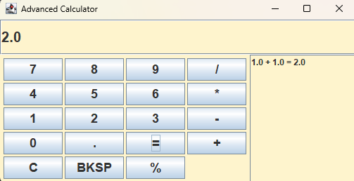

# Calculator

##How I Built the Calculator

This project is a desktop calculator built using Java Swing. It follows an event-driven programming approach, meaning the program reacts to user actions like button clicks and keyboard input.

### Step 1: Building the User Interface
I first created the main window using a `JFrame`, then added:
- A `JTextField` for the display
- A grid of `JButtons` for numbers and operations
- A history panel using `JList` to store past calculations

This created a simple but functional calculator layout.

---

### Step 2: Handling Button Input
Each button is connected to a single method called `handleInput()`.

Instead of writing separate code for every button, I reused one method:
- Number buttons add digits to the display
- Operator buttons store the first number and selected operation
- The equals button triggers calculation

This made the code cleaner and easier to manage.

---

### Step 3: Storing Operations
When an operator is clicked:
- The current number is saved as `first`
- The operator is stored in a variable
- The display is cleared for the next input

Example:
User enters: `12 + 5`
- first = 12
- operator = "+"

---

### Step 4: Performing Calculations
When `=` is pressed:
- The second number is read from the display
- A `calculate()` method runs the correct operation using a switch statement
- The result is displayed

---

### Step 5: Adding History
Each calculation is saved in a list using `DefaultListModel`:

This allows users to see previous calculations.

---

### Step 6: Adding Keyboard Support
The calculator also supports keyboard input using a `KeyListener`:
- Numbers and operators can be typed directly
- Enter = calculate
- Backspace = delete last character

This improves usability and makes the app feel more like a real calculator.

---

### Step 7: Improving Code Structure
To keep the project clean:
- UI logic is separated from calculation logic
- Input handling is centralized in one method
- Repeated code is minimized

This makes the program easier to read and extend in the future.

### Photos of the functional calculator

##Why I Built a Website Version

Although the original calculator was built in Java Swing, I also created a web version using HTML, CSS, and JavaScript and hosted it on GitHub Pages.

###The Problem with Desktop Apps
Java Swing applications require users to:
- Install Java on their computer
- Download or run a `.jar` file
- Manually execute the program

This creates friction for readers and makes it harder to quickly evaluate the project.

---

###The Solution: A Web-Based Version
To solve this, I rebuilt the calculator as a web application.

This version:
- Runs directly in the browser
- Requires no installation
- Works on any device (Windows, Mac, mobile)
- Can be shared via a simple link

---

By hosting the project on GitHub Pages, I made it:
- Click-and-play
- Accessible anywhere
- More professional and industry-relevant
